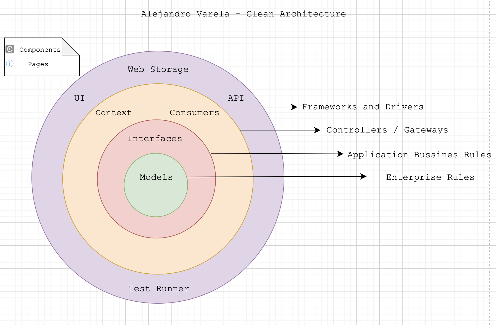

# Southern Code Frontend Challenge 🚀

This repository is intended to build an application that will consume the NASA API, where image data has been collected by NASA's Curiosity, Opportunity and Spirit rovers on Mars.

## Table of Contents

- [Getting started](#Getting-started).
- [Development tools](#Development-tools).
- [Challenge requirements](#Challenge-requirements).
- [Design principles](#Design-principles).
- [Architecture diagram](#Architecture-diagram).
- [Folder structure](#Folder-structure).
- [NASA API](#API).
- [Test design](#Test-design).
- [Deployment](#Deployment).

## Getting started

After cloning the repository we must install project dependencies declared in our ``package.json`` file. You can use your favorite node package manager 🫰.

### Installation

``` bash
$ npm install
```

### Running the app

```bash
# development
$ npm run dev

# build app
$ npm run build

# linting
$ npm run lint

# testing
$ npm run test

# production mode
$ npm run start
```

## Development tools

For the construction of our project we will use the following tools that will optimize the development of the product, also we will provide some quality attributes ant its corresponding modules that satisfy the tool.

- NextJS **next**: Is an open source React front-end development web framework created by Vercel that enables functionality such as server-side rendering and static website generation for React-based web applications. Some of the reasons why we decided to use it in the project is automatic code division that provides smart enough to load only the Javascript and CSS needed for a given page. (Efficiency and Performance)

- Eslint **eslint-config-next eslint**: Is a static code analysis tool for identifying problematic patterns found in JavaScript code covers both code quality and coding style issues (Reliability and Maintainability)

- SWR and Axios **axios swr**: SWR is a strategy to first return the data from cache (stale), then send the fetch request (revalidate), and finally come with the up-to-date data (Reactive Principle). Also axios is a simple promise based HTTP client for the browser (Security and Efficiency).

- Typescript **typescript**: Programming language that it's a superset of JavaScript, essentially adding static types and class-based objects. (Robustness and Testability)

- Chakra **@chakra-ui/react @emotion/react @emotion/styled framer-motion**: Is a simple, modular and accessible component library that gives you the building blocks you need to build your React applications. (Usability and Agility)

- Playwright **@playwright/test**: To determine whether the flow of an application from start to finish proceeds as expected. Also, End-to-end testing helps us test our app’s user experience by simulating real-world scenarios (Testability).

## Challenge requirements

1. Connects to the NASA API (https://api.nasa.gov/).
2. Obtains photos from the 'Mars Rover' endpoint.
3. Allows the user to see the photos of each rover (Curiosity, Opportunity and Spirit).
4. The photos list should be paginated showing a max of 25 photos per page (dynamic loading similar to facebook/instagram will be nice, but not required).
5. Allows the user to filter the rover photos by camera.
6. By default it shows the latest photos for current day.
7. Allows the user to search for photos based on 'Earth Day' date (2020-09-22).
8. Allows the user to search for photos based on the 'Sol' date (2890).
9. Test stage
10. Let the user store search parameters as favorites or bookmarks that can be recalled in the future (Local storage is accepted, any serverless way of storing data is also accepted).

## Design principles

Our goal is to design simple, composable components that cater to real-life UI design problems. That is why we follow those principles:

- Composition: Break down components into smaller parts with minimal props to keep complexity low, and compose them together. This will ensure that the styles and functionality are flexible and extensible.

- Accessibility: When creating a component, keep accessibility top of mind. This includes keyboard navigation, focus management, color contrast, voice over, and the correct aria-* attributes.

## Architecture diagram



## Folder structure

```bash
sc-mars-rover-challenge
  |- node_modules
  |- public
  |- src
     |- components
        |- common
        |- layout
     |- consumers
     |- hooks
     |- interfaces
     |- pages
     |- storage
     |- types
  |- test
  .env
  .eslintrc.json
  .gitignore
  next.config.js
  package.json
  tsconfig.json
  README.md
```

- **Public folder**: Contains static files such as images, and other assets, etc. which you don't want to be processed by webpack. Files in this folder are copied and pasted as they are directly into the build folder.

- **Src**: Base on JAMStack that it is an architecture, model and philosophy that determines a way to develop an application that meets the 5 pillars of a well "designed" application or framework: 1. Operational excellence, 2. Security, 3. reliability, 4. Efficiency, 5. Cost Optimization.

   - Components: Are independent and reusable bits of code. They serve the same purpose as JS functions, but work in isolation and return HTML base on **hydratation** principle. (Attach to UI Layer)
   - Consumers: Serve as an entry and exit point for a network as all data must pass through or communicate with the gateway prior to being routed. The use of Javascript to consume data over HTTP has allowed the growth of a myriad of services that provide various functionalities.(Attach to Gateway Layer)
   - Hooks: Are the functions which "hook into" React state and lifecycle features from function components. (Attach to UI Layer)
   - Interfaces: Contracts that allow the definition of rules necessary for the application and that may be defined by external agents regardless of their specific implementation (Attach to Application Rules)
   - Pages: (Attach UI Layer)
   - Storage: The Web Storage API provides a mechanism for storing and retrieving smaller, data items consisting of a name and a corresponding value. This is useful when you just need to store some simple data, like the user's name, whether they are logged in, what color to use for the background of the screen, etc.(Attach UI Layer)
   - Types: Entities definition base on nasa api and data structures base on filter requirements(Attach to Enterprise Rules)

- **Test**: E2E tests using Playwright that simulate actual user actions and are designed to test how a real user would likely use the application.

## API

According to the API docs already provided by NASA, you can get all Perseverance's latest photos from this URL:

```bash
https://api.nasa.gov/mars-photos/api/v1/rovers/
```

Also, photos are organized by the sol (Martian rotation or day) on which they were taken, counting up from the rover's landing date. If instead you prefer to search by the Earth date on which a photo was taken, you can do that, too. Along with querying by date, results can also be filtered by the camera with which it was taken and responses will be limited to 25 photos per call. Queries that should return more than 25 photos will be split onto several pages, which can be accessed by adding a 'page' param to the query.

### Rover Cameras

|Abbreviation    |  Camera  | Curiosity | Opportunity | Spirit|
|----------------|----------|-----------|-------------|-------|
|FHAZ|Front Hazard Avoidance Camera|  ✅ |  ✅  | ✅  |
|RHAZ|Rear Hazard Avoidance Camera|  ✅ |  ✅  | ✅  |
|MAST|Mast Camera|  ✅ |  ❌  | ❌  |
|CHEMCAM|Chemistry and Camera Complex|  ✅ |  ❌  | ❌  |
|MAHLI|Mars Hand Lens Imager|  ✅ |  ❌  | ❌  |
|MARDI|Mars Descent Imager|  ✅ |  ❌  | ❌  |
|NAVCAM|Navigation Camera|  ✅ |  ✅  | ✅  |
|PANCAM|Panoramic Camera|  ❌ |  ✅  | ✅  |
|MINITES|Miniature Thermal Emission Spectrometer (Mini-TES)|  ❌ |  ✅  | ✅  |

**Taken from Nasa Apis Documentation**

## Test Design


## Deployment


